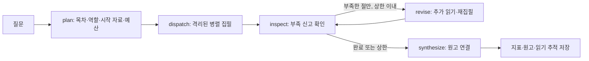

# 사료 · 한국사 딥리서처

고조선·삼국·남북국·고려·조선·근현대의 한국사를 자료별로 나누어 읽고, 근거가 보이는 장문 보고서를 만드는 LangGraph + OpenAI + Streamlit 프로젝트입니다. 기존 근현대사 연구에 고대부터 조선까지의 자료와 질문을 확장했습니다.

## 앱 구현 스크린샷

로컬 Streamlit 앱에서 촬영한 화면입니다. **질문 입력 → 분담 연구 → 보고서 확인 → 원문 근거 추적** 순서로 사용할 수 있습니다.

### 1. 연구 질문 입력

자료 수와 전체 원문 분량을 확인하고, 질문 예시를 선택하거나 연구 질문을 직접 입력합니다. 질문 아래에는 자료를 나누어 읽는 이유가 표시됩니다. 왼쪽 메뉴에서 새 연구, 저장된 연구 보기, 실험 비교로 이동할 수 있습니다.


*질문 입력 화면 예시입니다. 하단에는 앞서 실행한 연구 결과가 남아 있어, 입력 중인 질문과 표시된 결과는 서로 다를 수 있습니다.*

### 2. 실제 읽은 원문과 근거 추적

연구 결과의 **누가 무엇을 읽고 썼나** 탭에서는 절별 원고, 직접 근거 구절, 실제 읽은 문서 범위와 재집필 이력을 확인할 수 있습니다. 아래 화면은 `훈민정음` 문서의 **0~2,000자** 범위를 펼친 모습입니다. 보고서에서 의심스러운 내용을 발견하면 해당 절이 받은 원문과 대조할 수 있습니다.


*출처와 원문 구절의 존재를 확인하는 기능이며, 문장 전체의 역사적 정확성을 보증하지는 않습니다. 실제 오류를 추적한 사례와 비교 실험 해석은 [프로젝트 보고서](REPORT.md)에 정리했습니다.*

## 실행

Python 3.11 이상을 권장합니다. Windows PowerShell에서:

```powershell
python -m venv .venv
.venv/Scripts/python.exe -m pip install -r requirements.txt
Copy-Item .env.example .env
# .env의 OPENAI_API_KEY에 본인의 키를 입력
.venv/Scripts/python.exe collect.py --target 80
.venv/Scripts/python.exe audit_corpus.py
.venv/Scripts/python.exe -m streamlit run app.py
```

이미 `data/corpus.json`이 있으면 수집 명령은 생략할 수 있습니다. `.env`가 존재하면 덮어쓰지 마세요. 새 연구는 OpenAI API를 호출하며 사용 요금이 발생합니다. 키는 서버에서만 읽고 로그·저장소에 기록하지 않습니다. API 키가 없어도 저장된 결과와 자료를 볼 수 있습니다.

기본 모델은 `gpt-4.1-mini`입니다. 제공된 스냅샷은 자료 80건, 1,607,230자, 1,067,701토큰이며 모델의 최대 창 1,047,576토큰을 넘습니다. 운영 입력 상한은 별도로 100,000토큰입니다. 재수집하면 위키백과 편집에 따라 숫자가 달라질 수 있습니다. `requirements-lock.txt`는 검증에 사용한 Windows / Python 3.14 환경의 패키지 기록입니다.

```powershell
.venv/Scripts/python.exe graph.py --question "고조선부터 해방까지 한국의 국가 운영과 대외 관계는 어떻게 변화했는가?"
.venv/Scripts/python.exe ablation.py --question-id q9 --repeats 3
.venv/Scripts/python.exe -m pytest -q
```

비교 실험은 반복마다 기본, 구역 안내 제거, 링크 탐색 제거, 재파견 제거, 단일 연구자를 실행합니다. 기본 결과와 단일 연구자의 **실제 읽기 글자 수**를 맞추며, 호출 횟수·토큰 비용까지 같다는 뜻은 아닙니다. 결과는 `output/reports/<실행 ID>/`에 저장됩니다. 실험은 반복마다 `output/ablation.json`을 갱신합니다.

## 구조



- `collect.py`: 위키백과 API, 2홉 후보, 3,000자 미만 제외, 실제 내부 링크, 출처·수집 시각·리비전.
- `graph.py`: LangGraph 상태와 노드. ThreadPoolExecutor로 독립 요청을 병렬 실행.
- `core.py`: 원문 범위와 읽기 예산 관리, OpenAI Responses API, 인용 검증.
- `baseline.py`, `ablation.py`: 단일 연구자와 실제 코드 경로가 달라지는 제거 실험.
- `metrics.py`: 정답표·판정 모델 없이 산출물과 읽기 기록으로 계산.
- `app.py`: 새 질문, 보고서, 절별 원문·원고, 두 보고서 비교.
- `REPORT.md`: 설계, 검증, 비교와 한계.

## 자료와 라이선스

위키백과 본문은 각 문서의 기여자에게 저작권이 있으며 CC BY-SA 4.0 등 해당 문서의 라이선스가 적용됩니다. `data/corpus.json`의 metadata에 원문 URL과 리비전을 보존합니다. 본문을 수정·재배포할 때 해당 조건을 지켜야 합니다. 프로젝트 코드는 MIT이며 원문 자료의 라이선스를 대체하지 않습니다.

위키백과는 연구용 2차 자료입니다. 역사 보고서의 확정적 사실 검증에는 사료·전문 연구와의 교차 확인이 필요합니다. 소스 안의 명령은 지시로 실행하지 않습니다.

공식 구현 참고: [LangGraph StateGraph](https://reference.langchain.com/python/langgraph/graph/state/StateGraph), [OpenAI 텍스트 생성](https://developers.openai.com/api/docs/guides/text), [MediaWiki TextExtracts](https://www.mediawiki.org/wiki/Extension:TextExtracts).
