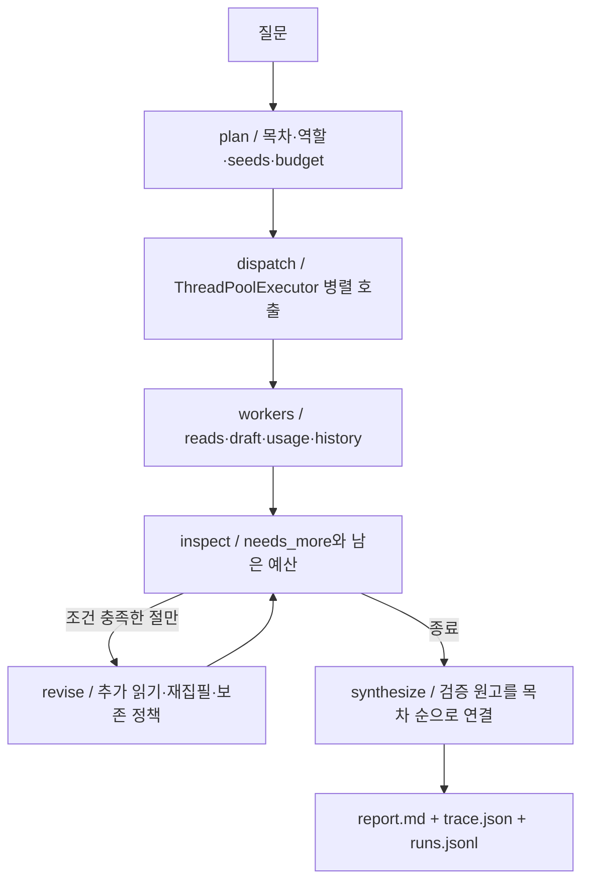
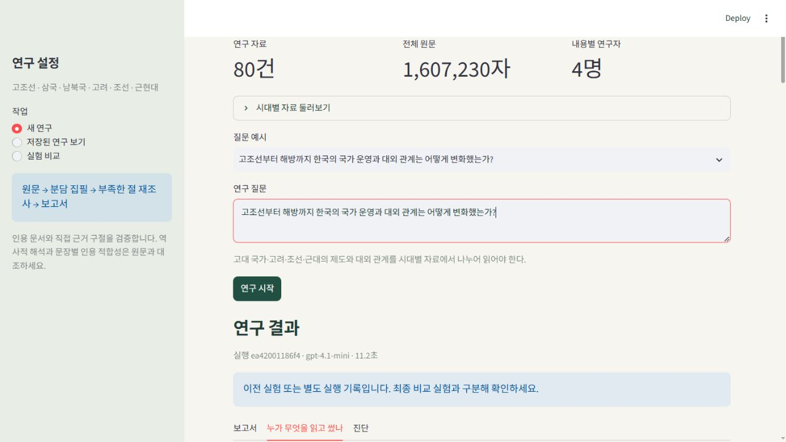
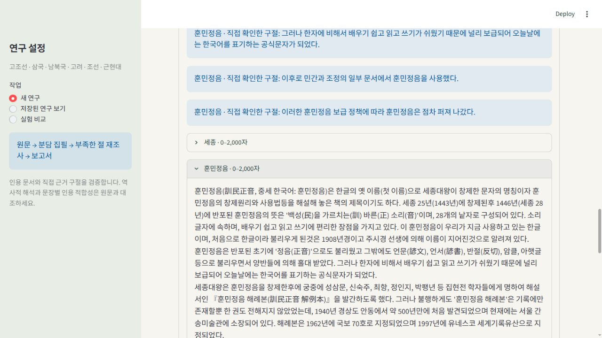

# 한국사 딥리서처 프로젝트 보고서

## 주제와 설계 의도

대표 질문은 “고조선부터 해방까지 한국의 국가 운영과 대외 관계는 어떻게 변화했는가?”이다. 고대 국가·고려·조선·근대의 자료를 나누어 읽으며 제도, 사회, 대외 관계를 연결한다. 통사 질문뿐 아니라 한 시대·제도·전쟁을 깊게 묻는 질문도 지원한다. 고조선 건국 전승은 검증된 역사 연대와 구별하도록 지시한다. 처음 구축한 근현대사 파이프라인을 사용자의 추가 요청에 따라 고조선부터 조선까지 확장했다.

첨부 안내의 필수 요건을 구현 요구사항으로 정리했다. 제출 화면 조작은 프로젝트 범위에 포함하지 않는다. 이전 파이프라인 소스는 제공되지 않았으므로 같은 코디네이터·서브에이전트 구조를 새로 구현했다.

## 자료와 질문

`collect.py`는 한국어 위키백과의 본문과 문서 사이 링크를 수집한다. 제목·본문 딕셔너리인 `docs`, 코퍼스 내부 연결만 남긴 `links`, URL·리비전·라이선스·수집 시각인 `metadata`를 저장한다. 3,000자 미만 문서는 제외하며, 시드의 공통 링크를 우선해 최대 2홉까지 넓힌다. 호출 제한은 지수적 재시도와 로컬 캐시로 대응한다.

자료량은 `data/corpus_stats.json`, 정확한 토큰 수는 `data/context_audit.json`으로 검증한다. 운영상 창 제한과 모델이 지원하는 최대 창은 구별한다. 모델을 바꿨다면 `config.json`의 모델과 최대 창, `.env`의 모델을 맞추고 감사를 다시 실행해야 한다. 모델의 창보다 작은 자료를 큰 자료라고 주장하지 않는다.

질문 16개는 고조선·삼국·남북국·고려·조선·근현대의 비교·인과 연결·장기 추적·분산 종합·단일 문서 대조를 포함한다. `q4`는 동학 농민 운동, `q16`은 훈민정음 한 문서로 상당 부분 답할 수 있는 질문이다. 이 질문에서 분업이 유리하다고 전제하지 않는다. 각 질문의 `why_split`은 정답표가 아니라 분업의 필요성을 검토하는 가설이다.

## 역할과 컨텍스트 격리

코디네이터가 원문 없이 제목 목록과 질문만 보고 내용별 절 4개를 정한다. 각 절에는 역할·범위·실재하는 시작 문서·읽기 예산이 배정된다. 문서 제목을 열거한 엄격한 JSON Schema와 실행 전 검증을 함께 적용한다. 기본 역할 명단은 고대 국가, 고려, 조선, 근대 전환이지만 질문이 조선만을 다루면 조선의 내용별 쟁점으로 재편한다. scope에는 결론을 미리 쓰지 않고 조사할 쟁점과 제외 범위만 기록한다.

각 서브에이전트 호출은 독립된 API 요청이다. 전체 통사 질문을 다시 주지 않고 자기 절의 조사 질문만 전달한다. 다른 에이전트의 원문이나 원고는 전달하지 않고 다른 구역의 제목·범위·시작 문서 이름만 전달한다. 기본형은 다른 절에 예약된 시작 문서를 읽기 탐색에서 제외한다. 구역 장치 제거 실험은 이 안내와 예약 제외를 함께 끈다. Python 오케스트레이터는 감사 목적으로 모든 기록을 저장하지만 코디네이터 **모델**에는 전체 원문을 올리지 않는다. `reads`는 문서 제목, 시작·끝 글자 위치, 실제 전달된 텍스트를 보존한다.

읽기 예산은 읽기 도구가 반환한 새 원문 글자 단위다. 다른 연구자가 같은 구간을 읽으면 각각 차감한다. 재집필 요청의 이전 원문, 근거 후보 목록, 이전 초안의 직접 인용 구절도 다시 전송되므로 최종 통사 실험의 API 제시 원문 총량(`worker_source_chars_presented`)은 읽기 도구 예산보다 클 수 있다. 이 둘과 모델 입력·출력 토큰을 별도로 기록한다. 초기 절 예산의 절반으로 집필하고 부족 신고가 있는 절만 남은 예산을 사용한다. 최대 집필 횟수는 2회다. 재집필이 기존 인용을 제거하거나 미열람 자료를 인용하면 이전 원고를 보존하고 거절 이유와 후보 원고를 남긴다. 인용 수가 같다고 원고 품질까지 같다는 의미는 아니다.

## 파이프라인과 상태

LangGraph State는 `question`, `plan`, `workers`, `pending`, `report`, `usage`, `coordinator_chars`로 구성된다. 종합 단계는 원고를 다시 LLM으로 요약하지 않는다. 이 선택은 이미 붙은 인용이 통합 과정에서 사라지는 문제를 줄이지만, 절 사이 논리적 전환과 중복을 자동 편집하지 못한다는 한계가 있다.

## 지표: 신호와 경보

| 지표 | 보는 장치 | 해석과 한계 |
|---|---|---|
| 실제 읽기 글자·예산 사용률 | 읽기 예산·대조군 공정성 | 낮으면 원문 부족 또는 조기 종료 여부 확인 |
| 코디네이터 원문 글자 0 | 모델 컨텍스트 격리 | 오케스트레이터 메모리와 구별 |
| 미열람 인용 수 | 자료 출처 추적 | 0이어야 함. 문장의 근거 적합성까지 증명하지 않음 |
| 문장 인용 비율 | 인용 누락 경보 | 동일한 문장 분리 함수를 모든 실험에 적용 |
| 절 간 읽은 문서 Jaccard 중복 | 영역 안내·분업 | 낮을수록 좋다는 순위 지표가 아님 |
| 미해결 절·재집필 횟수 | 자기 부족 신고·재파견 | 확신 과잉 모델은 부족을 숨길 수 있음 |
| 동시 실행 겹침 시간 | 실제 병렬성 | 1차 요청들의 시작·끝 시각 교집합 |
| 입력·출력 토큰 | API 사용량 | 읽기 예산과 별개이며 비용 비교에 필요 |

## 비교 실험 방법

기본 파이프라인, 구역 안내 제거, 링크 탐색 제거, 재파견 제거, 단일 연구자를 같은 질문으로 비교한다. 제거 실험은 반복 내 기본 실험의 목차와 시작 문서를 재사용해 계획 차이를 줄인다. 토글은 실제 API 입력 또는 실행 경로를 바꾼다. 단일 연구자도 **동일 모델로 제목 목록에서 시작 자료를 직접 선택**하며, 같은 원문·링크 탐색·읽기 함수를 사용하고 기본 실행의 실제 읽기 글자 수를 예산으로 받는다. 단순한 키워드 순서만으로 자료를 강제로 선택하는 초기 대조군은 최종 비교에서 교체했다. 따라서 중간에 임의로 적게 읽거나 자료 선택 능력을 제한하지 않는다.

읽기 글자 수를 맞췄다고 호출 횟수·총 토큰 수·동일 자료 선택까지 일치하는 것은 아니다. 그 차이는 기록하고 해석해야 한다. 각 조건은 3회 반복할 수 있고, 반복 간 변동을 확인한다. 지표를 합산해 승자 점수를 만들지 않는다. 사람은 나란히 놓인 보고서를 읽고 근거 문단을 원문 범위와 대조해야 한다.

## 최종 실행 결과

최종 스냅샷은 **80개 문서, 1,607,230자, 1,067,701토큰**이다. `o200k_base`로 문서 전체를 직렬화해 셌다. 사용 모델 GPT-4.1-mini의 최대 창 1,047,576토큰보다 **20,125토큰 많다**. 운영 입력 상한 100,000토큰과 모델의 최대 창을 혼동하지 않았다. 최소 문서 길이는 3,025자, 문서당 내부 링크 중앙값은 18.5개이고 고립 문서 및 잘못된 내부 링크는 0개다.

최종 5조건 × 3회, 총 **15편**의 보고서·원고·근거·읽기 기록을 보존했다. 아래 값은 3회 평균이며, 범위와 전체 수치는 [실험 요약](output/experiment-summary.md), 각 실행 ID는 [실험 기록](output/ablation.json)에 있다.

| 조건 | 새 원문 읽기 | 서로 다른 문서 | 절 사이 문서 중복 | 재집필 횟수 | 보고서 글자 |
|---|---:|---:|---:|---:|---:|
| 기본 | 36,000자 | 14.7개 | 0.7% | 2.0회 | 7,801자 |
| 구역 장치 제거 | 36,000자 | 14.7개 | 4.3% | 2.0회 | 6,996자 |
| 링크 탐색 제거 | 34,000자 | 8.0개 | 0% | 1.7회 | 6,668자 |
| 재파견 제거 | 24,000자 | 11.7개 | 1.1% | 0회 | 7,170자 |
| 단일 연구자 | 36,000자 | 18.0개 | 해당 없음 | 0회 | 4,471자 |

기본형과 단일 연구자의 읽기량은 반복별로 42,000·36,000·30,000자로 정확히 같았다. 모든 최종 원문 범위와 직접 인용 구절을 코퍼스와 다시 대조했고, 미열람 인용은 0건이다. 기본형의 1차 API 실행 시각도 실제로 겹쳤다. 문서 중복 수치는 구역 장치가 중복 탐색을 줄이는 신호이나 정확성 향상의 증거는 아니다. 링크를 끄면 자료 폭이 줄었지만 깊게 읽는 효과가 있을 수 있어 무조건 열등하다고 보지 않는다. 재파견은 추가 자료와 토큰 비용을 사용했으며 최종 부족 신고를 항상 없애지는 못했다.

단일 연구자에게도 최소 20문단과 같은 총 출력 상한을 주었다. 출력 잘림을 막기 위한 문단당 간결성 지시가 포함되어 있으므로 글 길이 차이를 품질 우위로 해석하지 않는다. 평균 입력 토큰은 기본형 99,625, 단일 연구자 61,296으로 **같은 읽기 도구 예산이 같은 API 비용을 뜻하지 않는다**. 직접 근거 후보 및 재집필 때 원문을 다시 제시하는 비용 때문이다.

### 보고서를 나란히 읽은 판단

세 번째 반복의 [기본 보고서](output/reports/d3e10385fe1b/report.md)와 [단일 보고서](output/reports/262414b02b3a/report.md)를 대조했다. 통사를 빠르게 훑는 목적에서는 단일 보고서가 더 간결하고 삼국 시대를 직접 다룬 점이 낫다. 기본 보고서는 시대별 절이 분명하고 조선의 군제·사회경제·문자 변화를 상세히 찾아보기 쉽지만, 고대 담당이 삼국의 구체적 자료 부족을 남긴 점 때문에 범위 완결성에서 낫다고 할 수 없다. 따라서 기본형이 더 길다는 이유로 승자로 정하지 않았다.

최종 기본 보고서의 근대 절에는 “갑신정변 이후 … 강화도 조약(1876년)”이라는 잘못된 선후관계가 남았다. 해당 절의 `갑신정변` 원문 0~2,000자에는 정변의 1884년이 제시되며, 보고서 자체의 1876년과도 순서가 맞지 않는다. 이 문제는 근대 담당의 원고에서 통합으로 그대로 전달되었다. 단일 보고서에는 광종이 전시과를 도입했다고 쓴 문장이 있으나, 실제 전달된 `고려` 원문은 **경종**의 전시과 도입으로 서술한다. 둘 다 문서 존재 검사나 직접 근거 구절 존재 검사만으로는 해결되지 않는 문장별 의미 오류다. 역사적 정확성 면에서는 어느 쪽도 검토 없이 확정 보고서로 사용할 수 없다.

좁은 질문 `q16`도 [비교 기록](output/single-document-control.json)으로 남겼다. 분업형과 단일 연구자는 모두 24,000자를 읽었으며, 분업형의 절 사이 문서 중복은 23.3%였다. 분업형은 5,667자, 단일형은 3,045자로 작성됐다. 한 번의 보조 실험이므로 일반적인 우열을 주장하지 않는다. 이 사례에서는 중복 배경과 조선 일반론을 줄이는 단일 연구자가 질문에 더 직접적으로 답하기 쉽다고 판단했다.

## 데모 설계

`app.py`에는 질문 예시 16개, 자유 질문, 시대별 자료 탐색, 저장된 연구, 두 보고서 비교 화면이 있다. 보고서 옆의 추적 탭에서 절별 역할·원고·직접 근거 구절·실제 읽은 범위·재집필 이력을 보여 준다. 숫자만 보여 주는 대시보드를 피하고 인용 문제가 생긴 절의 원문까지 접근할 수 있게 했다. API 키는 브라우저 입력값이나 실행 기록에 포함하지 않는다.

## 실제 실패 추적과 개선

초기 근현대사 실험 15편은 `output/ablation-modern-v1.json`에 보존했다. 이 실험은 원문 근거 구절 검증을 추가하기 전 버전이므로 현재 버전의 성능 증명으로 섞지 않는다.

기본 실행 `5b21f4274356`의 “개항·외교와 주권” 첫 문단은 강화도 조약을 “서구 국가들과의 외교 관계”로 설명했다. 실제로 전달된 `강화도 조약` 0~2,000자 첫 문장은 **조선과 일본 제국 사이의 조약**이라고 명시한다. 같은 잘못된 설명이 코디네이터의 scope에 이미 들어 있었고, 집필자가 이를 사실 근거처럼 받아들였다. 최종 통합에서 생긴 오류가 아니라 배정 → 집필 단계에서 발생한 오류였다. 미열람 인용 수는 0이었지만 이 오류를 잡지 못했다.

같은 반복의 단일 연구자 `cddb1efc6388`은 일본과의 조약이라고 정확히 썼다. 따라서 이 특정 문장에서는 단일 연구자가 더 낫다. 그러나 단일 보고서도 강화도 조약 한 문단에 독립협회·대한제국·광무개혁을 함께 묶어 붙인 인용의 범위가 넓고, “식민지로 나아가는 초석”처럼 필연적 결과로 읽힐 수 있는 표현이 있다. 기본형은 쟁점을 네 절로 분리해 찾기 쉬웠으나 근거 적합성 면에서 더 낫다고 할 수 없다.

또한 초기 단일 연구자에게는 전체 보고서도 최소 5문단이라고 지시했지만 분업형은 절마다 5문단이었다. 읽기 예산은 같았어도 글 길이 차이를 분업의 장점으로 해석하면 공정하지 않다. 현재 단일 연구자 지시는 **4개 절, 절마다 최소 5문단**으로 맞췄다. 출력 상한도 절당 상한의 4배다.

현재 버전은 (1) 코디네이터가 scope에 역사적 결론을 쓰지 못하도록 하고, (2) 배정문은 사실 근거가 아니라고 집필자에게 명시하며, (3) 실제 읽은 원문을 짧은 근거 구절로 나누어 ID를 부여한다. 모델은 각 문단을 뒷받침하는 근거 ID를 엄격한 JSON Schema의 열거형에서 선택하고, 코드는 그 ID의 정확한 문서 제목과 원문 구절을 붙인다. 원문에 없는 구절이나 직접 근거가 빠진 인용은 다시 검증한다. 최초 초안의 형식·인용 오류는 한 번만 교정하고, 두 번째도 실패하면 실행을 실패로 표시한다. 재집필 오류는 기존 원고를 보존한다. 이 장치는 문장 전체의 의미적 타당성을 자동 증명하지는 않는다.

인용 비율 지표의 초기 문장 분리에서 마침표 뒤 `[[문서]]`가 떨어져 나가는 오류도 발견했다. 인용을 앞 문장에 다시 붙이는 공통 함수로 수정하고 **모든 조건의 기록을 같은 함수로 재계산**했다. 조건에 따라 다른 지표 정의를 쓰지 않았다.

## 검증 상태

로컬 웹 화면에서 `훈민정음 창제의 배경과 반포 과정은 무엇인가?`를 입력해 실행 `ea42001186f4`가 완료되는 것을 확인했다. 보고서 생성부터 절별 원고, 직접 근거, `훈민정음`의 실제 읽기 범위 0~2,000자 펼치기까지 확인했다. 이 질문은 한 핵심 문서로 충분한데 네 절로 나누면 배경 설명이 반복되고 조선 사회 일반론으로 범위가 넓어진다. 따라서 이런 좁은 질문에는 분업형을 기본 선택으로 권하지 않는다.

이 웹 실행의 네 번째 절에는 “1446년에 창제”라는 문장이 있고, 첫 번째 절에는 “1443년 창제·1446년 반포”라고 썼다. 실제 `훈민정음` 0~2,000자에는 후자의 구별이 명시되어 있다. 즉 인용 출처가 실재하고 직접 구절 검증을 통과해도 문장 전체나 절 사이의 연대 일관성은 보증되지 않는다. 이 오류는 네 번째 집필자의 초안에서 최종본으로 그대로 전달됐다. 원고를 몰래 고쳐 실행 품질을 부풀리지 않고 실패 추적 사례로 보존했다. 개선 대상으로 절 사이의 날짜·사건 충돌 탐지와 좁은 질문의 단일 연구자 라우팅을 남긴다.

통사 파일럿에서는 고대·조선 담당이 다른 시대를 반복하는 문제가 있었다. 모델 교체만으로 해결되지 않았고, 근본 원인은 전체 질문을 모든 집필자에게 다시 전달하는 입력 설계와 타 구역 시작 문서로 넘어가는 탐색이었다. 최종 버전에서는 절별 질문만 전달하고 다른 구역 시작 문서를 제한했다. `ablation-4o-pilot.json`과 `ablation-scope-pilot.json`은 중단된 파일럿으로, 최종 3회 반복 비교표와 분리한다. 최종 비교는 같은 GPT-4.1-mini 모델에서 모든 조건을 다시 실행한다.

현재 구현 테스트는 예산 제한, 링크 제거, 미열람 인용, 잘못된 자료 배정, 부족한 절만 재집필, 재파견 제거 경로를 확인한다. 실제 LLM 실행·비교와 화면 캡처는 별도 실행 기록으로 확인한다. 가짜 모델 기반 테스트를 실제 연구 결과로 제시하지 않는다.

## 개발 회고와 보완점

가장 중요한 선택은 “원문을 코디네이터 모델에 올리지 않는다”를 구체적인 API 데이터 흐름으로 만드는 것이었다. 모든 원문을 상태에 모아둔 후 전체 상태를 프롬프트에 넣으면 분업 구조가 형식에 그친다. 이 프로젝트는 계획 프롬프트와 집필 프롬프트를 별도로 구성한다.

다음 개선 대상은 한국어 형태소 기반 검색, 인용 문장에 대한 정확한 근거 구간 표시, 사료·전문 논문의 교차 검증이다. 현재는 제목 키워드와 링크를 사용하므로 관련성이 낮은 연결로 예산이 분산될 수 있다. 또한 절별 인용을 보존하는 정책은 보수적이어서 더 나은 재집필본을 거부할 가능성이 있다. 실제 실패 문장과 자료까지 추적해 정책을 조정해야 한다.
